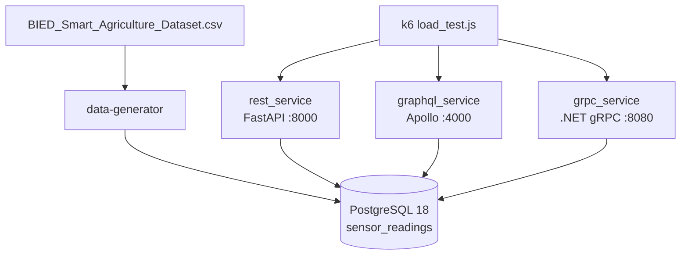

# IoTS-Projekat-1

Projekat za predmet **Internet stvari i servisa** — sistem za čuvanje i pristup očitavanjima IoT senzora u poljoprivredi. Isti skup podataka (`sensor_readings`) dostupan je kroz tri API paradigme: **REST**, **GraphQL** i **gRPC**, radi poređenja protokola i performansi.

## Sadržaj

- [Opis](#opis)
- [Arhitektura](#arhitektura)
- [Struktura repozitorijuma](#struktura-repozitorijuma)
- [Zavisnosti](#zavisnosti)
- [Konfiguracija](#konfiguracija)
- [Pokretanje bez Dockera](#pokretanje-bez-dockera)
- [Pokretanje sa Dockerom](#pokretanje-sa-dockerom)
- [API pregled](#api-pregled)
- [Load test (k6)](#load-test-k6)

## Opis

Projekat simulira **pametnu poljoprivredu**: generator učitava podatke iz CSV fajla (`BIED_Smart_Agriculture_Dataset.csv`) u PostgreSQL tabelu `sensor_readings`. Tri nezavisna servisa implementiraju isti CRUD nad tim podacima, svaki u skladu sa svojom tehnologijom:

| Servis | Tehnologija | Port (host) |
|--------|-------------|-------------|
| REST | FastAPI + Uvicorn | 8000 |
| GraphQL | Node.js + Express + Apollo Server | 4000 |
| gRPC | ASP.NET Core 8 + gRPC | 8080 |
| PostgreSQL | PostgreSQL 18 | 5432 |
| Generator | Python (psycopg) | — |

## Arhitektura



**Tok podataka:**

1. PostgreSQL se podiže sa šemom iz `data-generator/iots-projekat-1.sql`.
2. Generator briše postojeće redove, zatim ubacuje **10 redova na svakih 10 sekundi** dok ne obradi ceo CSV.
3. API servisi čitaju i pišu u istu tabelu — razlika je samo u protokolu i formatu poruka.
4. k6 (`load_test.js`) paralelno opterećuje sva tri API-ja i generiše `load_test_summary.json`.

## Struktura repozitorijuma

```
IoTS-Projekat-1/
├── data-generator/          # Python generator + SQL šema + CSV
├── rest_service/            # FastAPI REST API
├── graphql_service/         # Express + Apollo GraphQL
├── grpc_service/GrpcService/  # .NET 8 gRPC servis + .proto
├── protos/                  # Google protobuf (za k6 gRPC)
├── docker-compose.yml
├── load_test.js             # k6 load test
└── load_test_summary.json   # rezultati poslednjeg testa (generiše se)
```

## Zavisnosti

### Alati (preporučeno)

| Alat | Verzija | Namena |
|------|---------|--------|
| [Docker](https://www.docker.com/) + Docker Compose | aktuelna | pokretanje celog stack-a |
| [PostgreSQL](https://www.postgresql.org/) | 18 | lokalna baza (bez Dockera) |
| [Python](https://www.python.org/) | 3.12+ | generator i REST |
| [Node.js](https://nodejs.org/) | ≥ 22.18 | GraphQL servis |
| [.NET SDK](https://dotnet.microsoft.com/) | 8.0 | gRPC servis |
| [k6](https://grafana.com/docs/k6/latest/set-up/install-k6/) | aktuelna | load test |

### Python (`data-generator`, `rest_service`)

| Paket | Servis |
|-------|--------|
| psycopg[binary] ≥ 3.2 | generator, REST |
| fastapi ≥ 0.115 | REST |
| uvicorn[standard] ≥ 0.32 | REST |
| psycopg-pool ≥ 3.2 | REST |

### Node.js (`graphql_service`)

| Paket | Verzija (min.) |
|-------|----------------|
| @apollo/server | ^4.11 |
| @as-integrations/express4 | ^1.0 |
| express | ^4.21 |
| graphql | ^16.10 |
| graphql-parse-resolve-info | ^4.13 |
| pg | ^8.13 |

### .NET (`grpc_service`)

| Paket | Verzija |
|-------|---------|
| Grpc.AspNetCore | 2.57 |
| Npgsql | 8.0.6 |
| Target framework | net8.0 |

## Konfiguracija

Svi servisi koriste iste parametre baze (podrazumevane vrednosti u zagradama):

| Promenljiva | Podrazumevano | Opis |
|-------------|---------------|------|
| `DB_HOST` | `localhost` | PostgreSQL host |
| `DB_PORT` | `5432` | PostgreSQL port |
| `DB_NAME` | `iots-projekat-1` | ime baze |
| `DB_USER` | `postgres` | korisnik |
| `DB_PASSWORD` | `vobo1234` | lozinka |
| `PORT` | `4000` | samo GraphQL servis |

gRPC servis koristi connection string u `grpc_service/GrpcService/appsettings.json` ili env varijablu `ConnectionStrings__Default` (u Dockeru).

Primer `.env` u root-u (opciono, za Docker Compose):

```env
DB_USER=postgres
DB_PASSWORD=vobo1234
DB_NAME=iots-projekat-1
```

---

## Pokretanje bez Dockera

### 1. PostgreSQL

Instaliraj PostgreSQL 18 i kreiraj bazu:

```sql
CREATE DATABASE "iots-projekat-1";
```

Primeni šemu:

```powershell
psql -U postgres -d iots-projekat-1 -f data-generator/iots-projekat-1.sql
```

*(Na Windowsu putanja može biti drugačija, npr. preko pgAdmin Query Tool.)*

### 2. Generator podataka

```powershell
cd data-generator
python -m venv .venv
.\.venv\Scripts\Activate.ps1
pip install -r requirements.txt

$env:DB_HOST = "localhost"
$env:DB_PORT = "5432"
$env:DB_NAME = "iots-projekat-1"
$env:DB_USER = "postgres"
$env:DB_PASSWORD = "vobo1234"

python generator.py
```

Generator radi dok ne obradi ceo CSV (pauza 10 s između batch-eva). Ostavi ga u posebnom terminalu ili pokreni jednom pre testiranja API-ja.

### 3. REST servis

```powershell
cd rest_service
python -m venv .venv
.\.venv\Scripts\Activate.ps1
pip install -r requirements.txt

$env:DB_HOST = "localhost"
$env:DB_NAME = "iots-projekat-1"
$env:DB_USER = "postgres"
$env:DB_PASSWORD = "vobo1234"

uvicorn main:app --host 0.0.0.0 --port 8000 --reload
```

- API: http://localhost:8000  
- Swagger: http://localhost:8000/docs  

### 4. GraphQL servis

```powershell
cd graphql_service
npm install

$env:DB_HOST = "localhost"
$env:DB_NAME = "iots-projekat-1"
$env:DB_USER = "postgres"
$env:DB_PASSWORD = "vobo1234"
$env:PORT = "4000"

npm start
```

- Endpoint: http://localhost:4000/graphql  
- Primer upita (POST, `Content-Type: application/json`):

```json
{
  "query": "{ sensorReadings(limit: 5) { id deviceId temperature } }"
}
```

### 5. gRPC servis

```powershell
cd grpc_service/GrpcService

$env:ConnectionStrings__Default = "Host=localhost;Port=5432;Database=iots-projekat-1;Username=postgres;Password=vobo1234"

dotnet run
```

Servis sluša na **http://localhost:8080** (HTTP/2, plaintext). Definicija servisa: `grpc_service/GrpcService/Protos/sensor_readings.proto`.

Za testiranje koristi [grpcurl](https://github.com/fullstorydev/grpcurl), Postman (gRPC) ili BloomRPC.

**Redosled pokretanja:** PostgreSQL → generator (opciono, za podatke) → REST / GraphQL / gRPC (paralelno u zasebnim terminalima).

---

## Pokretanje sa Dockerom

### Preduslov

Instaliran Docker Desktop (ili Docker Engine + Compose plugin).

### Podizanje celog sistema

Iz root foldera projekta:

```powershell
docker compose up -d --build
```

Compose fajl (`name: iots-projekat-1`) podiže:

| Servis | Kontejner | Port |
|--------|-----------|------|
| postgres | iots-postgres | 5432 |
| data-generator | iots-data-generator | — |
| rest_service | iots-rest-service | 8000 |
| grpc_service | iots-grpc-service | 8080 |
| graphql_service | iots-graphql-service | 4000 |

**Redosled zavisnosti:** `postgres` (healthcheck) → `data-generator` → API servisi.

Šema baze se primenjuje automatski pri prvom startu Postgres kontejnera (`01-schema.sql` mount).

### Provera statusa

```powershell
docker compose ps
docker compose logs -f rest_service
docker compose logs -f data-generator
```

### Zaustavljanje

```powershell
docker compose down
```

Brisanje kontejnera **i volumena** (briše i podatke u bazi):

```powershell
docker compose down -v
```

### Pristup servisima (Docker)

Isti URL-ovi kao lokalno: `localhost:8000`, `localhost:4000/graphql`, `localhost:8080`.

---

## API pregled

Sva tri API-ja podržavaju CRUD nad `sensor_readings`:

| Operacija | REST | GraphQL | gRPC |
|-----------|------|---------|------|
| Lista | `GET /sensor-readings?limit=&offset=` | `sensorReadings` query | `ListSensorReadings` |
| Jedan zapis | `GET /sensor-readings/{id}` | `sensorReading(id)` | `GetSensorReading` |
| Kreiranje | `POST /sensor-readings` | `createSensorReading` | `CreateSensorReading` |
| Izmena | `PUT /sensor-readings/{id}` | `updateSensorReading` | `UpdateSensorReading` |
| Brisanje | `DELETE /sensor-readings/{id}` | `deleteSensorReading` | `DeleteSensorReading` |

- **REST:** pri kreiranju sva polja su obavezna; pri `PUT` dozvoljena je delimična izmena.  
- **GraphQL:** `SensorReadingCreateInput` (sva polja obavezna), `SensorReadingUpdateInput` (opciona polja).  
- **gRPC:** `SensorReadingCreateInput` / `SensorReadingUpdateInput` u `.proto` fajlu.

## Load test (k6)

Instaliraj [k6](https://grafana.com/docs/k6/latest/set-up/install-k6/), pokreni stack (Docker ili lokalno), zatim iz root-a:

```powershell
k6 run -e VUS=10 load_test.js
k6 run -e VUS=100 load_test.js
```

Opcione promenljive: `REST_URL`, `GRAPHQL_URL`, `GRPC_ADDR`.

Skripta testira REST (list + get), GraphQL (`sensorReadings`) i gRPC (`ListSensorReadings`, `GetSensorReading`) i ispisuje prosečnu latenciju, **p95** i **success RPS** po API-ju. Rezultati se čuvaju u `load_test_summary.json`.

**Napomena:** GraphQL šalje 1 HTTP zahtev po iteraciji, REST i gRPC po 2 — pri poređenju RPS-a to imaj u vidu.

---

## Licenca

Vidi [LICENSE](LICENSE).
